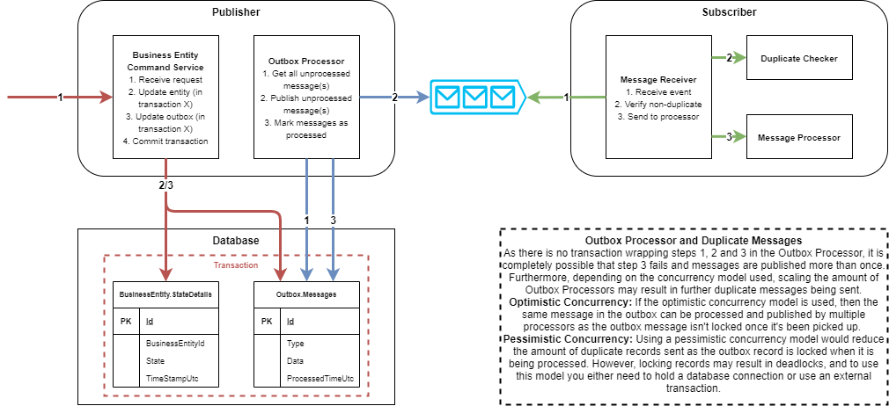

# Outbox Pattern Demo

This project contains a basic implementation of the Outbox Pattern in C#.

## What is the Outbox Pattern?

### The problem

Often when the state of a business entity changes, you want to publish an event stating that this has happened so that other microservices are in sync. To achieve this, you would do the following:

1. Receive message
2. Update business entity
3. Publish 'EntityUpdated' event

However, if step (2) is not idempotent and only step (3) fails, we find ourselves in a scenario where the business entity has been updated an other microservices are not aware of this change.

### One (of many) solutions

The Outbox Pattern solves this problem by moving the event publisher into an outbox processor. The command service then updates the entity and adds a record to the outbox messages in the same transaction. The outbox processor will poll this outbox messages for any unprocessed messages, and publish them as they arrive. This is illustrated in the diagram below:



## This project

This project demo's the Outbox Pattern using NServiceBus (In Memory) and EntityFramework (SQLite). It contains 3 apps:

| App                          | Purpose                                                      |
| ---------------------------- | ------------------------------------------------------------ |
| OutboxPatternDemo.Publisher  | ASP.NET Web API that allows you to update the state of the Business Entity, and uses the Outbox Pattern to guarantee that State Changed events are published at least once |
| OutboxPatternDemo.Subsriber  | Console App that subscribes to State Changed events, implementing several ways to check for duplicate messages |
| OutboxPatternDemo.Monitoring | Runs the Particular Service Platform, which allows you to monitor events within the system |

### Getting started

All of the code is in the `src` folder. It requires the dotnet 6 SDK to run.

#### NServiceBus

Get your free development license from: https://particular.net/license/nservicebus?t=0&p=servicepulse

Then, copy your `license.xml` file to `%LocalAppData%/ParticularSoftware`. You may need to restart VS (or potentially your PC) for the license file to be picked up. This will be required NSB monitoring.

#### Entity Framework

The underlying data source for outbox events uses SQL Server. Before you can run the OutboxPatternDemo.Publisher/Subscriber apps, you need to create a local database called `OutboxPatternDemo`.

First, verify that Entity Framework is installed:

```powershell
# install + update Entity Framework tool
dotnet tool install --global dotnet-ef
dotnet tool update --global dotnet-ef
```

Then, run the following commands from a PowerShell terminal in the `src/OutboxPatternDemo.Publisher` directory:

```powershell
# create contexts
dotnet ef database update --context BusinessEntityContext
dotnet ef database update --context CustomOutboxContext
```

and the following commands from the `src/OutboxPatternDemo.Subscriber` directory:

```powershell
# create contexts
dotnet ef database update --context DuplicateKeyContext
```

### Updating migrations

First, verify that Entity Framework is installed:

```powershell
# install + update Entity Framework tool
dotnet tool install --global dotnet-ef
dotnet tool update --global dotnet-ef
```

`src/OutboxPatternDemo.Publisher`:

```powershell
# create contexts
dotnet ef migrations add <migrationname> --context BusinessEntityContext
dotnet ef migrations add <migrationname> --context CustomOutboxContext
```

`src/OutboxPatternDemo.Subscriber`:

```powershell
# create contexts
dotnet ef migrations add <migrationname> --context DuplicateKeyContext
```